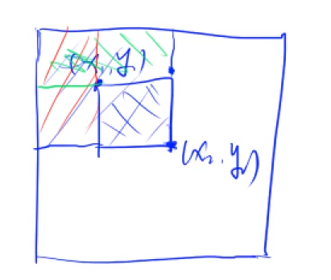
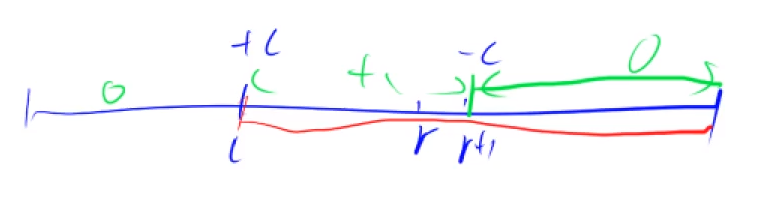
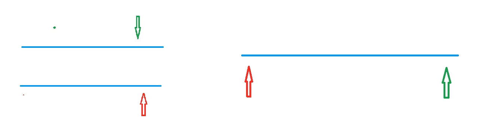
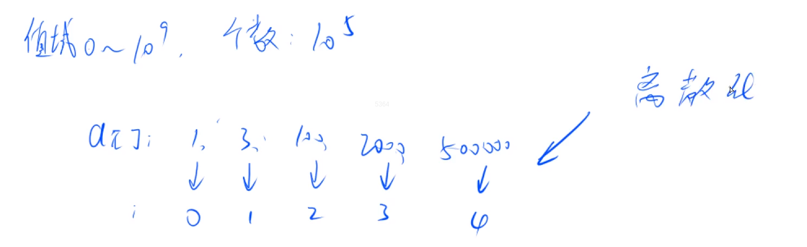
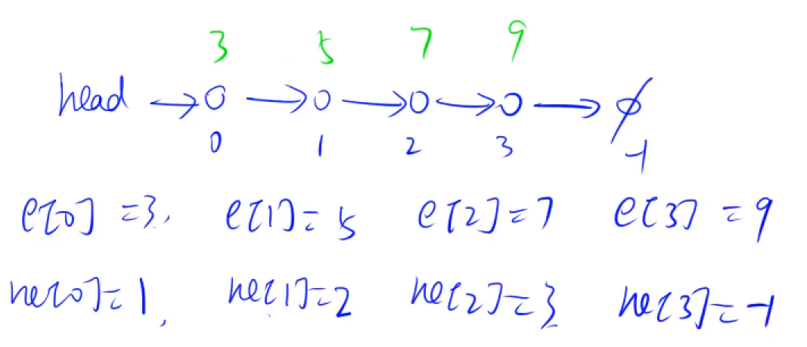
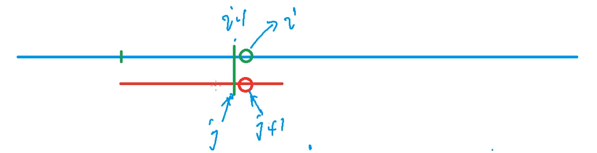
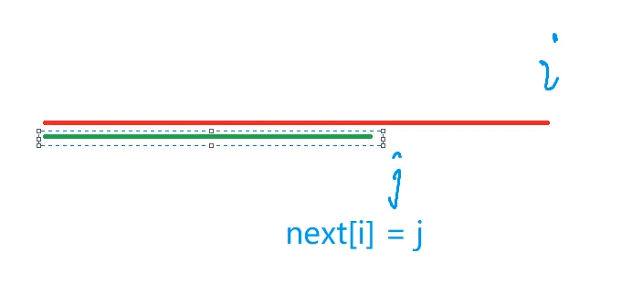
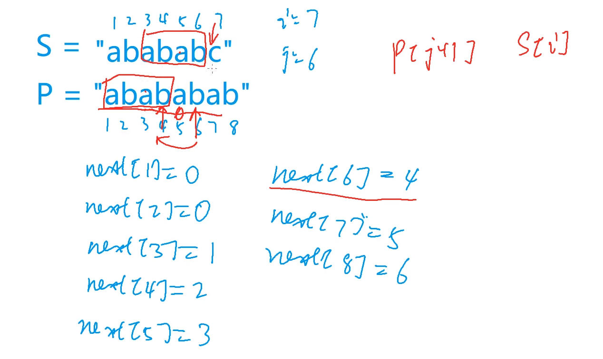
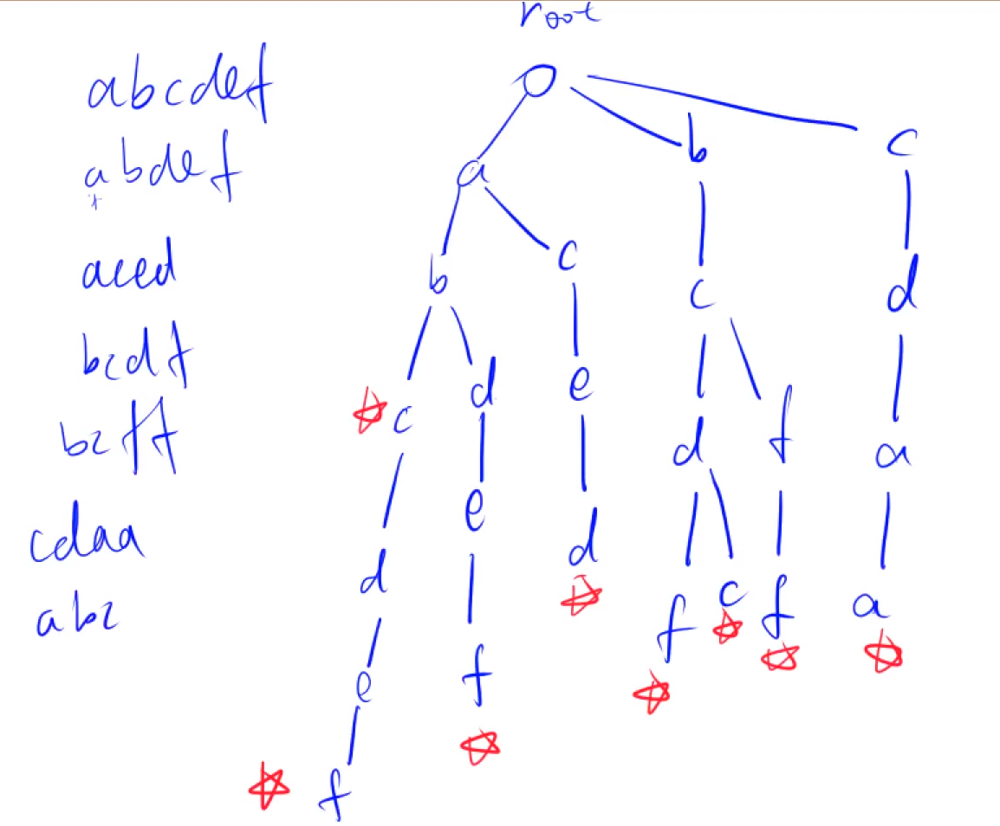
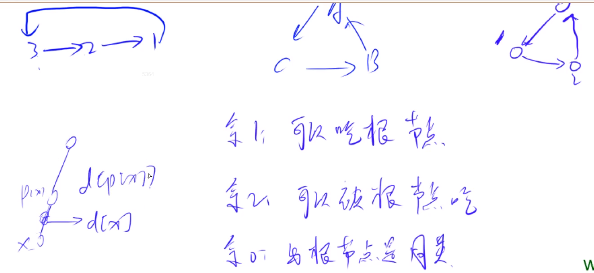

[toc]

# Notes

## 基础算法

### 快速排序 
$O(nlog^n)$
- 确定分界点：$q[l]，q[r]，q[l + r >> 1]$ ，随机
- 调整范围：始终让中点左侧满足小于等于x，右侧大于等于x
- 递归处理左右两段

```cpp
void qsort(int l, int r) {
    if (l >= r) return;
    int i = l - 1, j = r + 1, x = q[l + r >> 1];
    while (i < j) {
        while (q[++i] < x);
        while (q[--j] > x);
        if (i < j) swap(q[i], q[j]);
    }
    qsort(l, j);
    qsort(j + 1, r);
}
```

### 归并排序
$O(nlog^n)$
- 把数组$a$从中间一分为二
- 分别将每个部分的最小值放入新的数组$t$中（每个数组都有序）
- 当一个数组的指针指向最后一个时，另一个数组全部放入$t$中

时间复杂度 $nlog^n$
```cpp
void msort(int l, int r) {
    if (l >= r) return;
    int mid = l + r >> 1;
    msort(l, mid), msort(mid + 1, r);
    int k = 0, i = l, j = mid + 1;
    while (i <= mid && j <= r)
        if (q[i] <= q[j]) t[k++] = q[i++];
        else t[k++] = q[j++];
    while (i <= mid) t[k++] = q[i++];
    while (j <= r) t[k++] = q[j++];
    for (i = l, j = 0; i <= r; i++, j++) q[i] = t[j];
}
```
#### 归并求逆序对


### 二分
$O(logn)$
查找大于等于$\geq x$的第一个数
```cpp
while (l < r) {
    int mid = (l + r) >> 1;
    if (a[mid] >= x) r = mid;
    else l = mid + 1;
}
```
查找大于等于$\leq x$的第一个数
```cpp
while (l < r) {
    int mid = (l + r + 1) >> 1;
    if (a[mid] >= x) l = mid;
    else r = mid - 1;
}
```
### 前缀和
#### 一维前缀和
$s[r] - s[l-1]$
```cpp
    for (int i = 1; i <= n; i++) scanf("%d", &a[i]);
    for (int i = 1; i <= n; i++) s[i] = s[i - 1] + a[i];
    while (m--) {
        int l, r;
        scanf("%d%d", &l, &r);
        printf("%d\n", s[r] - s[l - 1]);
    }
```
#### 二维前缀和

$S[x_2][y_2]-S[x_2][y_2-1]-S[x_1-1][y_2]+S[x_1-1][y_1-1]$
```cpp
for (int i = 1; i <= n; i++)
        for (int j = 1; j <= m; j++) scanf("%d", &a[i][j]);
    for (int i = 1; i <= n; i++)
        for (int j = 1; j <= m; j++) //求前缀和
            s[i][j] = s[i - 1][j] + s[i][j - 1] + a[i][j] - s[i - 1][j - 1];
    while (q--) {
        int x1, y1, x2, y2;
        scanf("%d%d%d%d", &x1, &y1, &x2, &y2);
        printf("%d\n", s[x2][y2] - s[x1 - 1][y2] - s[x2][y1 - 1] + s[x1 - 1][y1 - 1]);  //算出子矩阵和
    }
```
### 差分
~~构造，使得a数组为b数组的前缀和，即b数组为a数组的差分~~
解决在区间l到r的操作+c或者-c的操作

```cpp
void insert(int l, int r, int c) {
    b[l] += c;
    b[r + 1] -= c;
}

int main() {
    scanf("%d%d", &n, &m);
    for (int i = 1; i <= n; i++) scanf("%d", &a[i]);
    for (int i = 1; i <= n; i++) insert(i, i, a[i]);
    while (m--) {
        int l, r, c;
        scanf("%d%d%d", &l, &r, &c);
        insert(l, r, c);
    }
    for (int i = 1; i <= n; i++) b[i] += b[i - 1], printf("%d ", b[i]);
    return 0;
}
```
#### 二维差分
输入一个 n 行 m 列的整数矩阵，再输入 q 个操作，每个操作包含五个整数 x1,y1,x2,y2,c，其中 (x1,y1) 和 (x2,y2) 表示一个子矩阵的左上角坐标和右下角坐标。
每个操作都要将选中的子矩阵中的每个元素的值加上 c。
请你将进行完所有操作后的矩阵输出
```cpp 
void insert(int x1, int y1, int x2, int y2, int c) {
    b[x1][y1] += c;
    b[x2 + 1][y1] -= c;
    b[x1][y2 + 1] -= c;
    b[x2 + 1][y2 + 1] += c;
}

int main() {
    scanf("%d%d%d", &n, &m, &q);
    for (int i = 1; i <= n; i++) 
        for (int j = 1; j <= m; j++) scanf("%d", &a[i][j]);
    for (int i = 1; i <= n; i++)
        for (int j = 1; j <= m; j++)
            insert(i, j, i, j, a[i][j]);
    while (q--) {
        int x1, y1, x2, y2, c;
        cin >> x1 >> y1 >> x2 >> y2 >> c;
        insert(x1, y1, x2, y2, c);
    }
    for (int i = 1; i <= n; i++)
        for (int j = 1; j <= m; j++) 
            b[i][j] += b[i - 1][j] + b[i][j - 1] - b[i - 1][j - 1];
    for (int i = 1; i <= n; i++) {
        for (int j = 1; j <= m; j++) printf("%d ", b[i][j]);
        puts("");
    }
    return 0;
}
```
### 双指针
#### 具体逻辑

$O(n)$
从暴力优化
```cpp
for (int i = 0, j = 0; i < n; i++) {
    while (j < i && check(i, j)) j++;
}
```
#### 例1--求单词
```cpp
gets(str);
int l = strlen(str);
for (int i = 0; i < l; i++) {
    int j = i;
    while (j < l && str[j] != ' ') j++;
    for (int k = i; k < j; k++) cout << str[k];
    puts("");
    i = j;
}
```
#### 例2--最长不重复子序列
##### 暴力
$O(n^2)$
```cpp
for (int i = 0; i < n; i++)
    for (int j = 0; j <= i; j++) {
        if (check(i, j)) res = max(res, i - j + 1);
    }
```
##### 双指针思路
```cpp
for (int i = 0, j = 0; i < n; i++) {
    while (j <= i && check*i, j) j++;
    res = max(res, i - j + 1);
}
```
##### 双指针实现
s[]为在j--i的区间内，每个数从出现的次数
```cpp
for (int i = 0; i < n; i++) scanf("%d", &a[i]);
    for (int i = 0, j = 0; i < n; i++) {
        s[a[i]]++;
        while (s[a[i]] > 1) s[a[j++]]--;
        res = max(res, i - j + 1);
    }
printf("%d\n", res);
```
#### 例3--数组元素的目标和
求出满足 $A[i]+B[j]=x$ 的数对 $(i,j)$。
```cpp
for (int i = 0, j = m - 1; i < n; i++) {
    while (j >= 0 && a[i] + b[j] > x) j--;
    if (a[i] + b[j] == x) {
        printf("%d %d\n", i, j);
        return 0;
    }
}
```
#### 例4--判断子序列
```cpp
int i = 0, j = 0;
    while (i < n && j < m) {
        if (a[i] == b[j]) i++;
        j++;
    }
    if (i == n) puts("Yes");
    else puts("No");
```


### 离散化

- a[]中可能有重复元素 -- 去重
- 如何算出a[]离散化后的值 -- 二分
  
```cpp
vector<int> alls;   //储存所有待离散化的值
sort(alls.begin(), alls.end()); //将所有值排序
alls.erase(unique(alls.begin(), alls.end()), alls.end());   //去掉重复元素
```
```cpp
//acw802
#include <bits/stdc++.h>


using namespace std;

const int N = 1e6 + 10;
typedef pair<int, int> PII;
int n, m, a[N], s[N];

vector<int> alls;
vector<PII> add, query;

int find(int x) {
    int l = 0, r = alls.size() - 1;
    while (l < r) {
    int mid = l + r >> 1;
    if (alls[mid] >= x) r = mid;
    else l = mid + 1;
    }
    return l + 1;
}

int main() {
    scanf("%d%d", &n, &m);
    for (int i = 0; i < n; i++) {
        int x, c;
        scanf("%d%d", &x, &c);
        add.push_back({x, c});
        alls.push_back(x);
    }
    for (int i = 0; i < m; i++) {
        int l, r;
        scanf("%d%d", &l, &r);
        query.push_back({l, r});
        alls.push_back(l);
        alls.push_back(r);
    }
    sort(alls.begin(), alls.end());
    alls.erase(unique(alls.begin(), alls.end()), alls.end());
    for (auto v : add) {
        int x = find(v.first);
        a[x] += v.second;
    }
    for (int i = 1; i <= alls.size(); i++) s[i] = s[i - 1] + a[i];
    for (auto v : query) {
        int l = find(v.first), r = find(v.second);
        printf("%d\n", s[r] - s[l - 1]);
    }
    return 0;
}
```
 
### 区间合并
```cpp
void merge(vector<PII> &segs) {
    vector<PII> res;
    sort(segs.begin(), segs.end());
    int st = -2e9, ed = -2e9;
    for (auto seg : segs) {
        if (ed < seg.first) {
            if (st != -2e9) res.push_back({st, ed}); 
            st = seg.first, ed = seg.second;    //更新现在在比较的端点
        }
        else ed = max(ed, seg.second);
    }
    if (st != -2e9) res.push_back({st, ed});
    segs = res;
}

int main() {
    int n;
    scanf("%d", &n);
    vector<PII> segs;
    for (int i = 0; i < n; i++) {
        int l, r;
        scanf("%d%d", &l, &r);
        segs.push_back({l, r});
    }
    merge(segs);
    printf("%d\n", segs.size());
    return 0;
}
```
## 数据结构
### 单链表

0号结点的值为3,next指针指向1号点
1号结点的值为5,next指针指向2号点
2号结点的值为7,next指针指向3号点
3号结点的值为9,next指针指向-1,即不存在

### 栈
```cpp
int stk[N], tt;

// 插入
stk[++tt] = x;

// 弹出
tt--;

// 判断栈是否为空
if (tt > 0) not empty
else empty

// 栈顶
stk[tt];
```
#### 单调栈
给定一个长度为 N 的整数数列，输出每个数左边第一个比它小的数，如果不存在则输出 −1
```cpp
int stk[N], tt;

int main() {
    int n;
    scanf("%d", &n);
    for (int i = 0; i < n; i++) {
        int x;
        scanf("%d", &x);
        while (tt && stk[tt] >= x) tt--;
        if (tt) printf("%d ", stk[tt]);
        else printf("-1 ");
        stk[++tt] = x;
    }
    return 0;
}
```

### 队列
```cpp
int q[N], hh, tt = -1;

// 插入
q[++tt] = x;

// 队头弹出
hh++;

// 判断队列是否为空
if (hh <= tt) not empty
else empty

// 取出队头元素
q[hh];

// 取出队尾元素
q[tt];
```
#### 单调队列 （滑动窗口）
$O(nk)$
队列维护窗口,存储最大值和最小值
队列中存储的是下标
```cpp
int a[N], q[N], n, k;

int main() {
    scanf("%d%d", &n, &k);
    for (int i = 0; i < n; i++) scanf("%d", &a[i]);
    int hh = 0, tt = -1;
    for (int i = 0; i < n; i++) {   //最小值
        //判断队头是否已经滑出窗口，i-k+1为窗口左端，队列存下标，
        if (hh <= tt && i - k + 1 > q[hh]) hh++;    //弹出
        while (hh <= tt && a[i] <= a[q[tt]]) tt--;  //队尾弹出
        q[++tt] = i;
        if (i- k + 1 >= 0) printf("%d ", a[q[hh]]);
    }
    puts("");
    hh = 0, tt = -1;
    for (int i = 0; i < n; i++) {
        if (hh <= tt && i - k + 1 > q[hh]) hh++;
        while (hh <= tt && a[i] >= a[q[tt]]) tt--;
        q[++tt] = i;
        if (i - k + 1 >= 0) printf("%d ", a[q[hh]]);
    }
    return 0;
}
```
### KMP
暴力枚举
```cpp
char S[N], P[N];

int main() {
    for (int i = 1; i <= n; i++) {
        bool flag = true;
        for (int j = 1; j <= m; j++) 
            if (s[i + j - 1] != p[j]) {
                flag = false;
                break;
                
            }
    }
    return 0;
}
```
$O(n)$

$Next$指针含义:

$p[1,j]=p[i-j+1,i]$ 


```cpp
void kmp() {
    cin >> n >> p + 1 >> m >> s + 1;
    for (int i = 2, j = 0; i <= n; i++) {
        while (j && p[i] != p[j + 1]) j = ne[j];
        if (p[i] == p[j + 1]) j++;
        ne[i] = j;
    }
    for (int i = 1, j = 0; i <= m; i++) {
        while (j && s[i] != p[j + 1]) j = ne[j];
        if (s[i] == p[j + 1]) j++;
        if (j == n) {
            printf("%d ", i - n);
            j = ne[j];
        }
    }
}
```


### trie树
Tire：存储和查找字符串集合的数据结构

```cpp
const int N = 1e5 + 10;

//下标是0的点，即是跟节点，又是空节点
int son[N][26], cnt[N], idx;
char str[N];

void insert(char *str) {    //插入--构建trie树
    int p = 0;
    for (int i = 0; str[i]; i++) {
        int u = str[i] - 'a';
        if (!son[p][u]) son[p][u] = ++idx;
        p = son[p][u];
    }
    cnt[p]++;
}

//查询出现次数
int query(char *str) {      //查询
    int p = 0;
    for (int i = 0; str[i]; i++) {
        int u = str[i] - 'a';
        if (!son[p][u]) return 0;
        p = son[p][u];
    }
    return cnt[p];  
}
```
#### 异或树
在给定的 N 个整数 $A_1，A_2……A_N$ 中选出两个进行 xor（异或）运算，得到的结果最大是多少
b把数字看成二进制数，每一位01就是字母，构建trie树，
`res = max(res, i xor j)`
```cpp
#include <bits/stdc++.h>


using namespace std;

const int N = 1e5 + 10, M = 31 * N;

int a[N], son[M][2], idx, n;

void insert(int x) {
    int p = 0;
    for (int i = 30; i >= 0; i--) {
        int u = x >> i & 1;
        if (!son[p][u]) son[p][u] = ++idx;
        p = son[p][u];
    }
}

int query(int x) {
    int p = 0, res = 0;
    for (int i = 30; i >= 0; i--) {
        int u = x >> i & 1;
        if (son[p][!u]) p = son[p][!u], res = res * 2 + !u; 
        else p = son[p][u], res = res * 2 + u;
    }
    return res;
}

int main() {
    scanf("%d", &n);
    for (int i = 0; i < n; i++) scanf("%d", &a[i]), insert(a[i]);
    int res = 0;
    for (int i = 0; i < n; i++) {
        int t = query(a[i]);
        res = max(res, a[i] ^ t);
    }
    printf("%d\n", res);
    return 0;
}
```


### 并查集 （Union并Find查Set集）
- 将两个元素合并
- 询问两个元素是否在一个集合中

每个集合用一棵树来表示。树根的编号就是整个集合的编号。
每个节点存储它的父节点
p[x]表示x的父节点

- 如何判断树根：`if(p[x] == x)`
- 如何求x的集合编号：`while (p[x] != x) x = p[x];`
- 如何合并两个集合：`p[x] = y`
  
```cpp
int find(int x) {
    if (p[x] != x) p[x] = find(p[x]);
    return p[x];
}

int main() {
    scanf("%d%d", &n, &m);
    for (int i = 1; i <= n; i++) p[i] = i;
    while (m--) {
        char op[2];
        int a, b;
        scanf("%s%d%d", op, &a, &b);
        if (op[0] == 'M') p[find(a)] = find(b);
        else {
            if (find(a) == find(b)) puts("Yes");
            else puts("No");
        }
    }
    return 0;
}
```

#### 连通块中点的数量
```cpp
int find(int x) {
    if (p[x] != x) p[x] = find(p[x]);
    return p[x];
}

int main() {
    cin >> n >> m;
    for (int i = 1; i <= n; i++)    p[i] = i, cnt[i] = 1;
    while (m--) {
        string op;
        cin >> op;
        int a, b;
        if (op == "C") {
            cin >> a >> b;
            a = find(a);
            b = find(b);
            if (a != b) {
                p[a] = b;
                cnt[b] += cnt[a];
            }
        }
        else if (op == "Q1") {
            cin >> a >> b;
            if (find(a) == find(b)) cout << "Yes" << endl;
            else    cout << "No" << endl;
        }
        else {
            cin >> a;
            cout << cnt[find(a)] << endl;
        }
    }
    return 0;
}
```
#### 例1--食物链
d[x]存储的永远是x到p[x]的距离，其目的是为了求x到根节点的距离

```cpp
//acw240
#include <iostream>

using namespace std;

const int N = 50010;

int n, m;
int p[N], d[N];

int find(int x) {
    if (p[x] != x)
    {
        int t = find(p[x]);
        d[x] += d[p[x]];
        p[x] = t;
    }
    return p[x];
}

int main() {
    scanf("%d%d", &n, &m);
    for (int i = 1; i <= n; i ++ ) p[i] = i;
    int res = 0;
    while (m -- ) {
        int t, x, y;
        scanf("%d%d%d", &t, &x, &y);
        if (x > n || y > n) res ++ ;
        else {
            int px = find(x), py = find(y);
            if (t == 1) {
                if (px == py && (d[x] - d[y]) % 3) res ++ ;
                else if (px != py) {
                    p[px] = py;
                    d[px] = d[y] - d[x];
                }
            }
            else {
                if (px == py && (d[x] - d[y] - 1) % 3) res ++ ;
                else if (px != py) {
                    p[px] = py;
                    d[px] = d[y] + 1 - d[x];
                }
            }
        }
    }
    printf("%d\n", res);
    return 0;
}


```
#### 路径压缩


### 哈希表
质数$p$要离2的整数次幂尽可能的远
#### 拉链法
```cpp
const int N = 1e5 + 3;  //大于1e5的第一个质数
int h[N], e[N], ne[N], idx;

void insert(int x) {
    int k = (x % N + N) % N;    //防止负数
    e[idx] = x, ne[idx] = h[k], h[k] = idx++;
}

bool find(int x) {
    int k = (x % N + N) % N;
    for (int i = h[k]; ~i; i = ne[i]) 
        if (e[i] == x) return true;
    return false;
}

int main() {
    memset(h, -1, sizeof h);
    int n;
    scanf("%d", &n);
    while (n--) {
        char op[2];
        int x;
        scanf("%s%d", op, &x);    //用scanf可以自动屏蔽空格和回车
        if (*op == 'I') insert(x);
        else {
            if (find(x)) puts("Yes");
            else puts("No");
        }
    } 
    return 0;
}
```
#### 开放寻址法
```cpp
const int N = 2e5 + 3, INF = 0x3f3f3f3f; //开二倍的长度

int h[N];

int find(int x) {
    int k = (x % N + N) % N;
    while (h[k] != INF && h[k] != x) {
        k++;
        if (k == N) k = 0;
    }
    return k;
}


int main() {
    int n;
    scanf("%d", &n);
    memset(h, 0x3f, sizeof h);
    while (n--) {
        char op[2];
        int x;
        scanf("%s%d", op, &x);
        int k = find(x);
        if (*op == 'I') h[k] = x;
        else {
            if (h[k] != INF) puts("Yes");
            else puts("No");
        }
    }
    return 0;
}
```